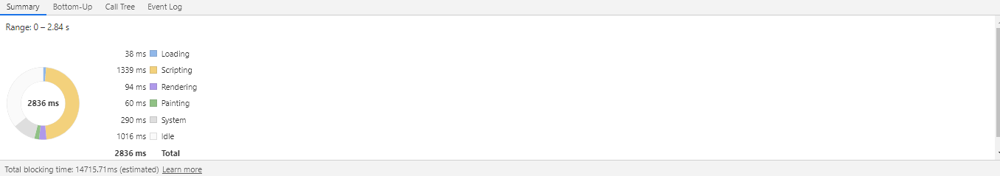
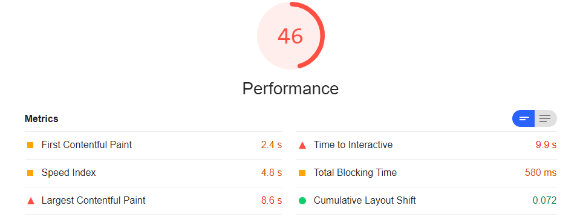
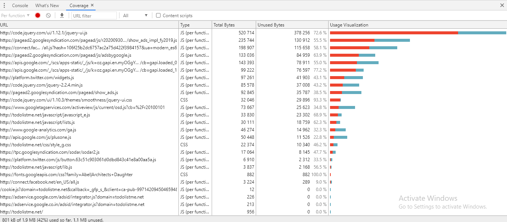
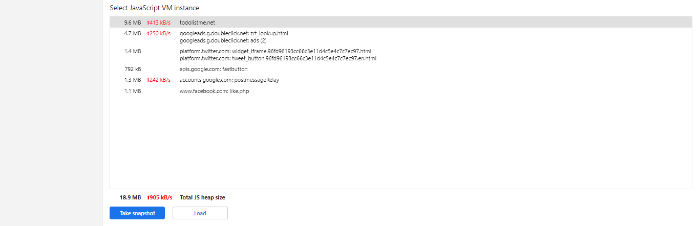
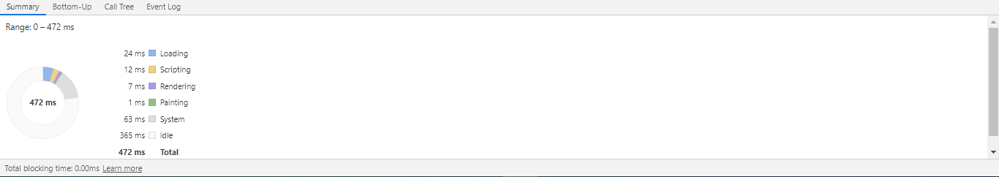
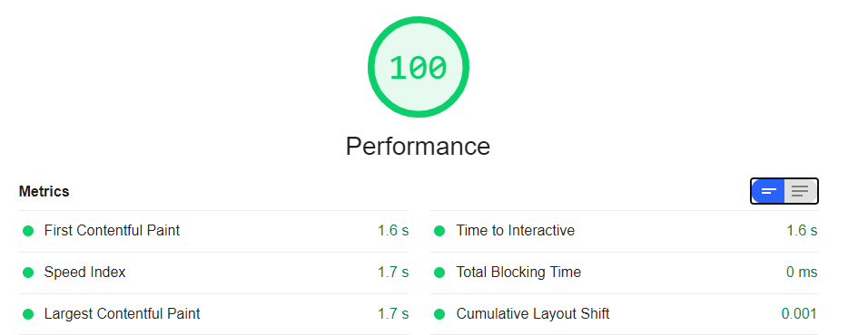
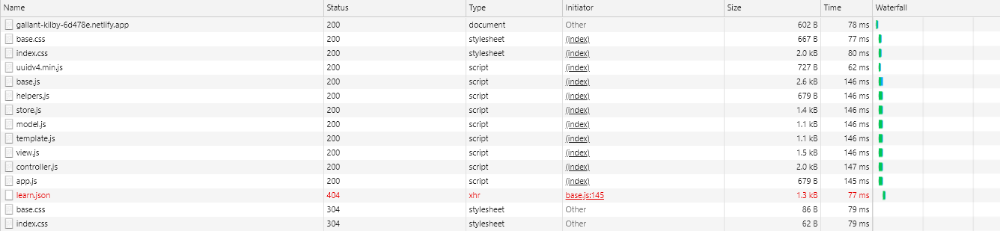
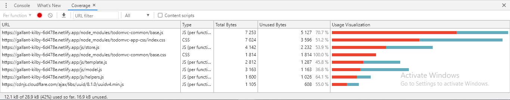
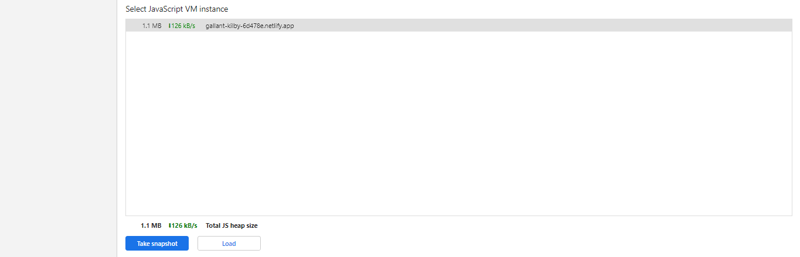

# Performance Audit

Performance Audit of our website and comparison with the competitor website(). For the purpose of this audit the website has been hosted at https://gallant-kilby-6d478e.netlify.app/

## Methodology
The audit is done using the chrome developer tools and Google's light house. From the developer tools, we primarily use the network tab, the performance tab and the code coverage. Lighthouse is a tool by google that measures key metrics like First Contentful Paint, Time to Interactive, and more, to give a score out of 100 and recommendations for improving performance.

## Competitor Audit

### Browser metrics

The site takes a significant amount of time to load. The First Contentful Paint happens at 2.4s which is beyond the recommended 2s. It takes the site 7 more seconds to become compeletely interactive which is jarring to the user experience

### Network usage

Resources are loaded in a blocking waterfall way, the requests for other resources are made only when one resource is fetched. The site ships a total of 1.4MB over the network

### Code coverage

The site does not use 58% of the code it ships, a total of 1.1MB which is a very significant amount especially for low network areas. A good portion of this comes from the jQuery library.

### Memory Usage

The site uses around 18.5MB of heap memory while running.

## Our Audit

### Browser metrics

The application takes very little time to start. It's First Contentful Paint and Time to Interactive are both under 2ms which is good by current standards. Do note however that our application is also much simpler than the competitor

### Network usage

The network operations are all non-blocking. Once the initial 'get /' request is sent, all other resources are fetched in parallel. This is because netlify provides HTTP/2 support. The site transfers a total of 16.6KB of resources over the network

### Code coverage

Our application does not use 58% of the code it ships. While the absolute value (16.9kb) is not much, this can be, and should be made much better.

### Memory Usage

The site uses around 1.1MB of heap memory while running.

### Opportunities
* Minify all the code we ship
* Reduce the amount of unused code
* Keep test coverage high
* Optimize images if we add any in the future

## Comparison

| Metric | Our site | Competitor |
| ------ | -------- | ---------- |
| First Contentful Paint | 1.6s | 2.4s |
| Time to Interactive | 1.6s | 9.9s |
| Resource fetching | Non-Blocking (Parallel) | Blocking |
| Bytes transferred over network | 16.6KB | 1.4MB |
| Unused Code | 16.9KB | 1.1MB |
| Memory Usage | 1.1MB | 18.5MB |
| Features | Simple ToDo functionality | ToDo functionality, online storage, multiple lists, ads, and more |
