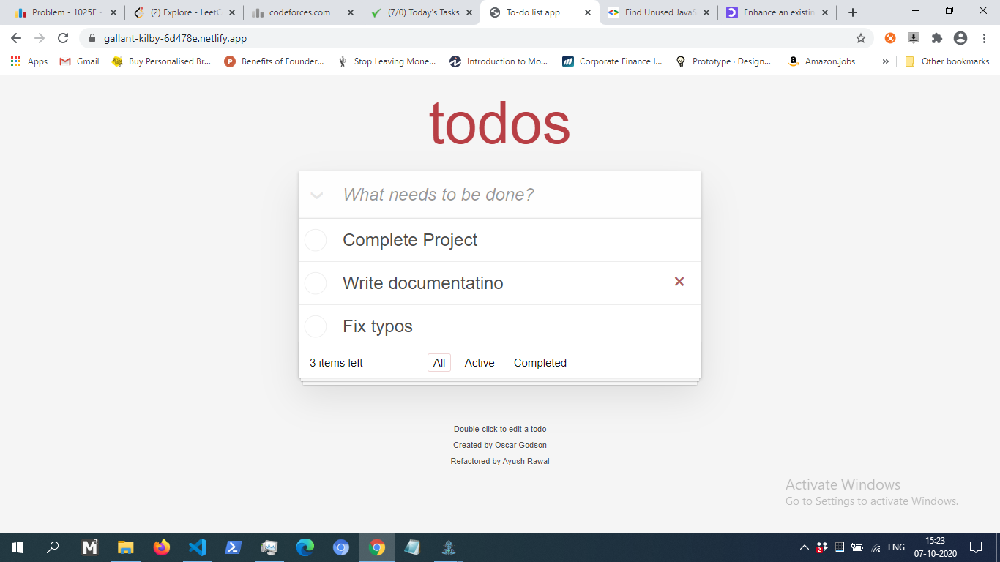

# How it works (For the User)

## Create todos

Enter your todo task in the text input that says "What needs to be done"
Press enter.
The task has now been added to your list of todos

## Edit todos

Double press on a todo to change to edit mode. 
Change the todo text as per liking. 
Press enter to save

## Mark todos as done/undone

Press the circular box to the left of todo to mark it as done or undone

## Mark all todos as done

Press the down arrow next to the input fied to mark all todos as done

## Delete todos

Place mouse/Hover over the todo you want to delete
Press the now visible red cross on the right side of the todo box.
The todo has now been deleted

## Delete done todos

Press the 'clear completed' button on the bottom right.
All todos marked as done have now been deleted
Note, for the button to appear you must have atleast 1 todo marked as done.

## Filter todos

You can filter the list to show only 'active', 'completed' or 'all' todos. This is done by pressing the appropriate filter buttons at the bottom of the todo list
